# MVC Architecture Sequence Diagrams

## Model - class diagram

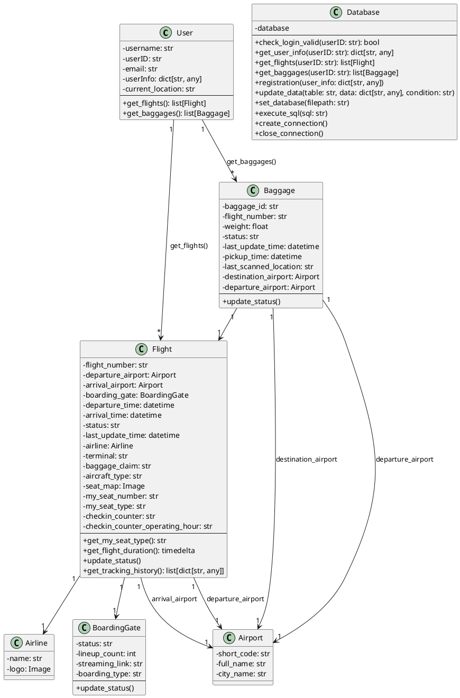

---

## 1. 登录页面（Login Page）

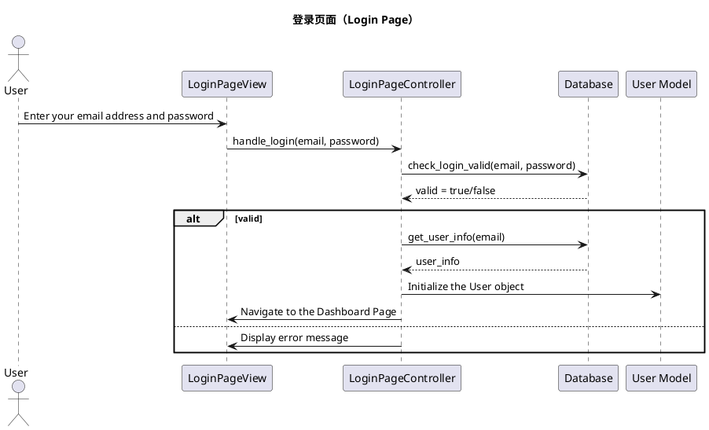

---

## 2. 注册页面（Register Page）

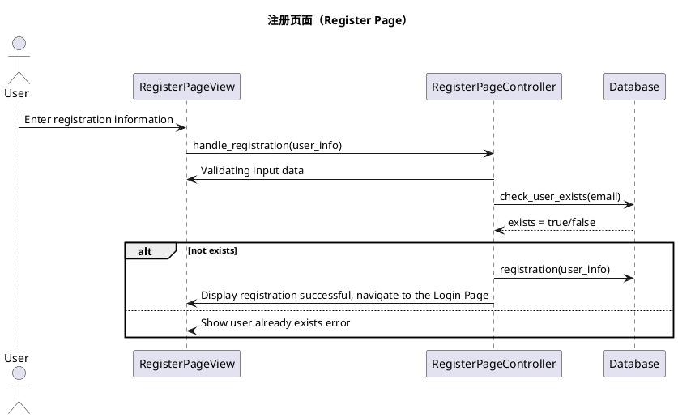

---

## 3. 仪表板页面（Dashboard Page）

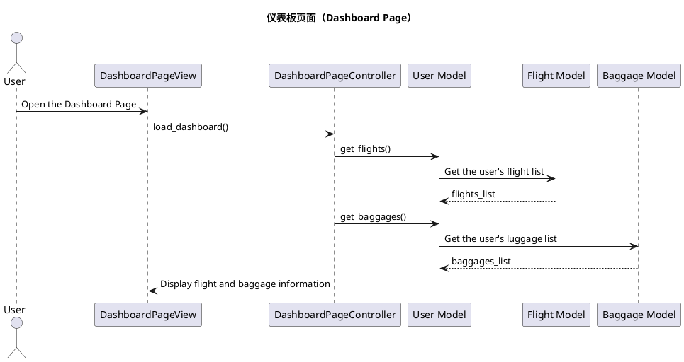

---

## 4. 关于我们页面（About Page）

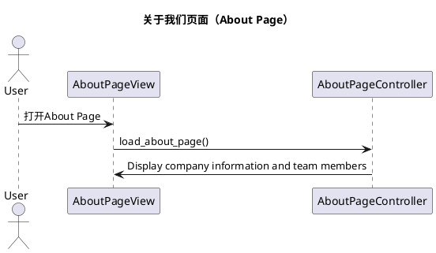

---

## 5. 帮助页面（Help Page）

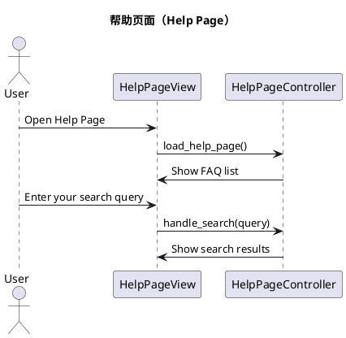

---

## 6. 个人资料页面（Profile Page）

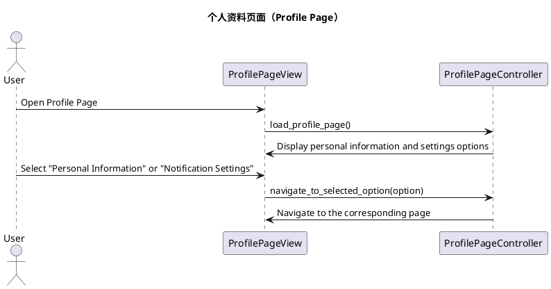

---

## 7. 个人信息页面（Personal Information Page）

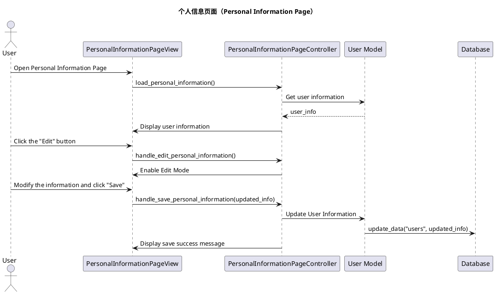

---

## 8. 通知设置页面（Notification Setting Page）

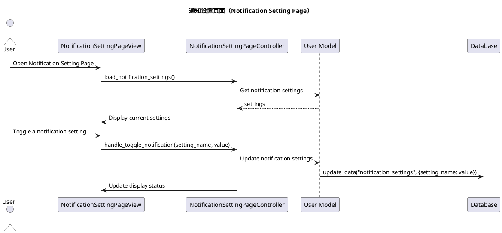

---

## 9. 通知中心页面（Notification Center Page）

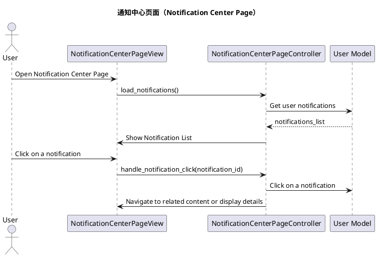

---

## 10. 登机信息页面（Boarding Information Page）

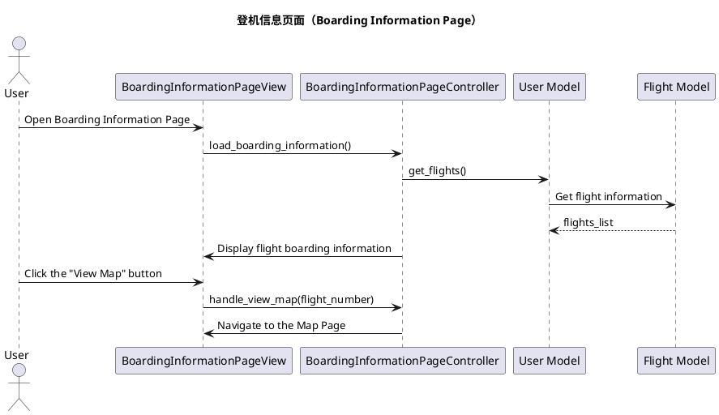

---

## 11. 我的航班页面（My Flight Page）

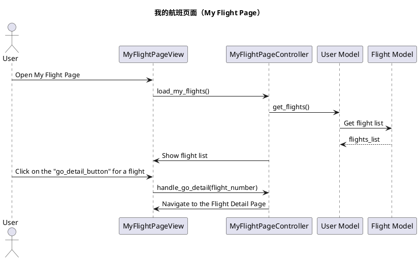

---

## 12. 我的行李页面（My Baggage Page）

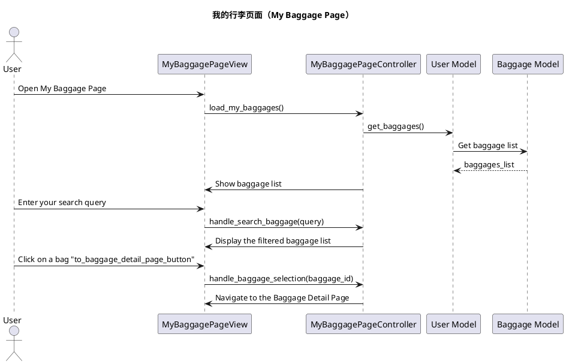

---

## 13. 航班详情页面（Flight Detail Page）

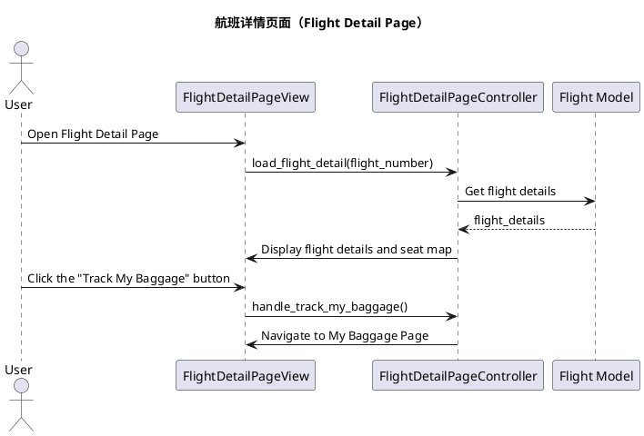

---

## 14. 行李详情页面（Baggage Detail Page）

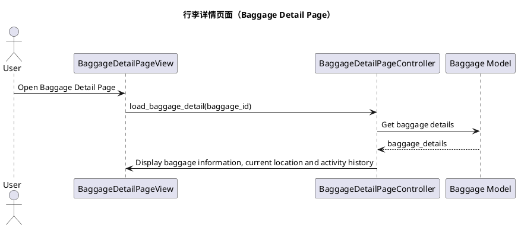

---

## 15. 地图页面（Map Page）

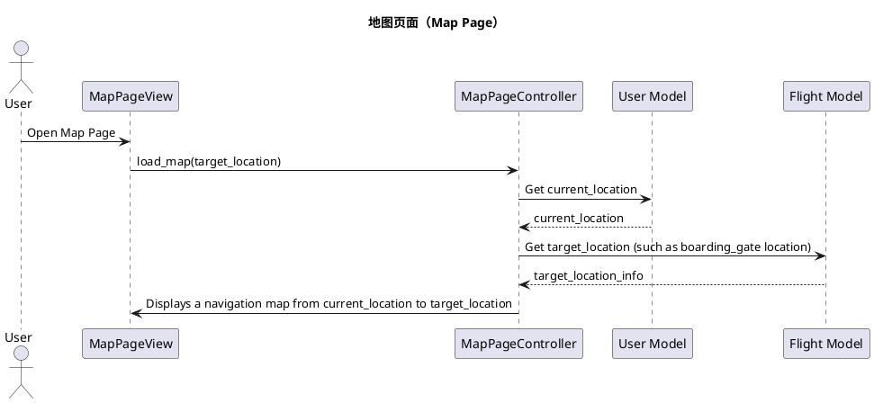

---