<!-- coding: utf-8 -->

# MVC Architecture Documentation

## Table of Contents

1. [Class Diagram](#class-diagram)
2. [Hierarchy Diagram](#hierarchy-diagram)
3. [Login Page](#1.-login-page)
4. [Register Page](#2.-register-page)
5. [Dashboard Page](#3-dashboard-page)
6. [About Page](#4-about-page)
7. [Help Page](#5-help-page)
8. [Profile Page](#6-profile-page)
9.  [Personal Information Page](#7-personal-information-page)
10. [Notification Setting Page](#8-notification-setting-page)
11. [Notification Center Page](#9-notification-center-page)
12. [Boarding Information Page](#10-boarding-information-page)
13. [My Flight Page](#11-my-flight-page)
14. [My Baggage Page](#12-my-baggage-page)
15. [Flight Detail Page](#13-flight-detail-page)
16. [Baggage Detail Page](#14-baggage-detail-page)
17. [Map Page](#15-map-page)

## Class Diagram

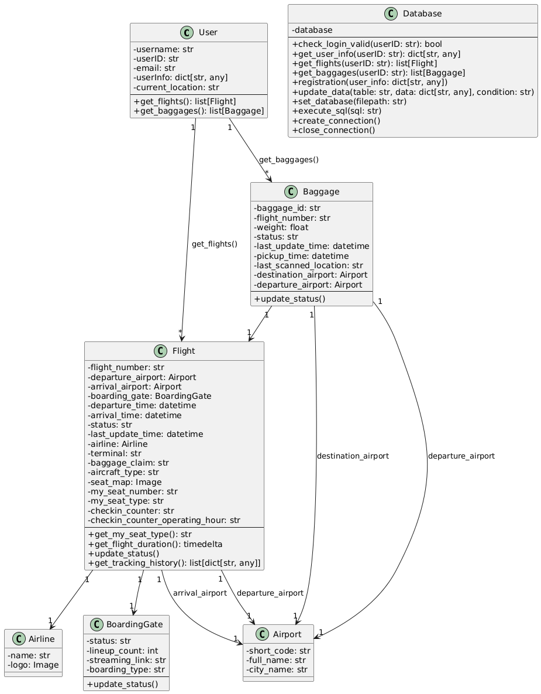

## Hierarchy Diagram

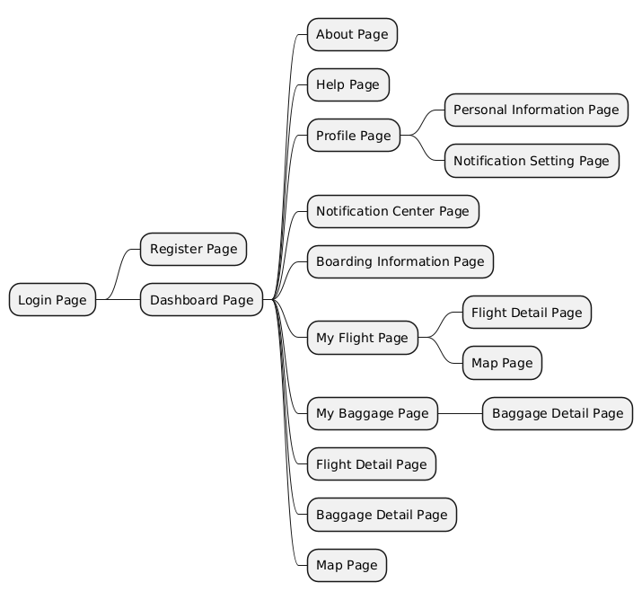

## 1. Login Page

### Sequence Diagram

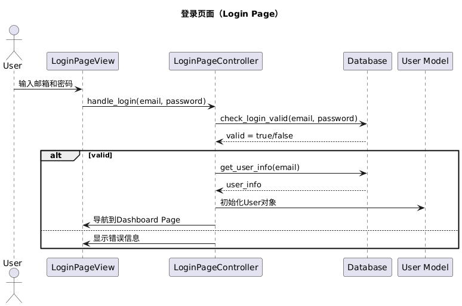

### View

#### Components

- `title_logo_image`
- `email_field`
- `password_field`
- `forgot_password_button`
- `login_button`
- `sign_up_button`

### Controller

#### Functions

- **handle_login(email: str, password: str) -> None**
  - Validates credentials using `Database.check_login_valid()`.
  - On success:
    - Retrieves user info via `Database.get_user_info()`.
    - Initializes `User` object.
    - Redirects to the Dashboard Page.
  - On failure:
    - Displays an error message.
- **handle_forgot_password() -> None**
  - Navigates to the Forgot Password Page (if implemented).
- **handle_sign_up() -> None**
  - Navigates to the Register Page.

## 2. Register Page

### Sequence Diagram

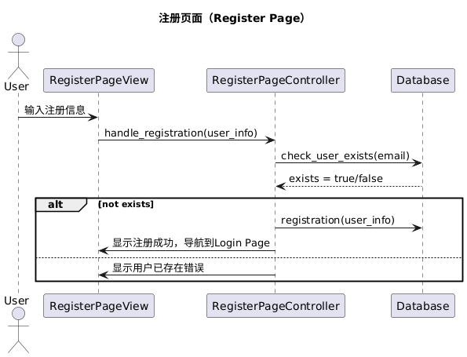

### View

#### Components

- `title_logo_image`
- `first_name_field`
- `last_name_field`
- `gender_field`
- `birthday_field`
- `hkid_field`
- `phone_number_field`
- `email_field`
- `password_field`
- `confirm_password_field`
- `register_button`

### Controller

#### Functions

- **handle_registration(user_info: dict[str, any]) -> None**
  - Validates input fields.
  - Checks for existing user via `Database.check_user_exists(email)`.
  - On success:
    - Registers user via `Database.registration(user_info)`.
    - Redirects to the Login Page.
  - On failure:
    - Displays appropriate error messages.

## 3. Dashboard Page

### Sequence Diagram

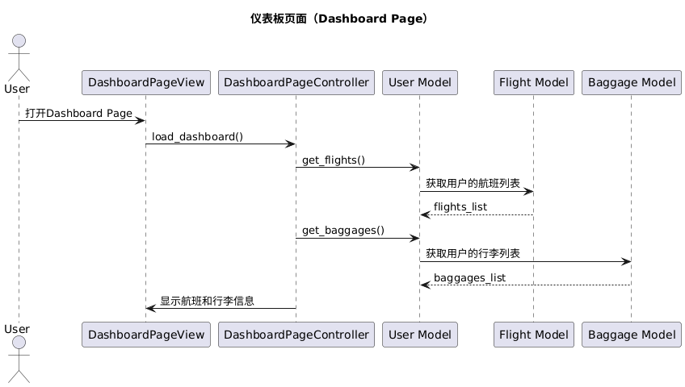

### View

#### Components

- `title_label` - "Dashboard"
- `slider_component`
- `subtitle_label` - "Upcoming Boarding"
- `flight_detail_container`
  - `title_label` - Flight details
  - `status_label`
  - `boarding_label`
  - `departure_time_label`
  - `view_flight_detail_button`
- `baggage_detail_frame`
  - `title_label` - Baggage details
  - `status_label`
  - `flight_number_label`
  - `current_location_label`
  - `view_baggage_detail_button`

### Controller

#### Functions

- **load_dashboard(user: User) -> None**
  - Retrieves flights and baggages:
    - Calls `user.get_flights()`.
    - Calls `user.get_baggages()`.
  - Populates the View with upcoming flight and baggage details.
- **handle_view_flight_detail(flight_number: str) -> None**
  - Navigates to the Flight Detail Page for the selected flight.
- **handle_view_baggage_detail(baggage_id: str) -> None**
  - Navigates to the Baggage Detail Page for the selected baggage.

## 4. About Page

### Sequence Diagram

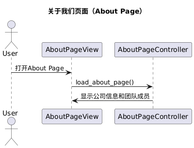

### View

#### Components

- `title_logo_image`
- `title_label` - "About Us"
- `about_us_paragraph_label`
- `subtitle_label` - "Our Team"
- `team_cards_container` (9 instances)
  - `photo_image`
  - `name_label`
  - `email_label`
- `subtitle_label` - "Committed to Excellence"
- `commitment_paragraph_label`

### Controller

#### Functions

- **load_about_page() -> None**
  - Populates the About Page with:
    - Company information.
    - Team member profiles.
    - Commitment statements.

## 5. Help Page

### Sequence Diagram

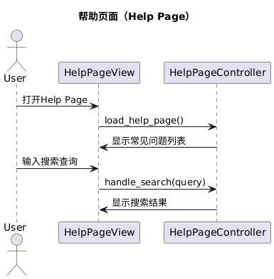

### View

#### Components

- `title_label` - "Help"
- `searchbar_field`
- `question_card_containers` (5 instances)
  - `title_label`
  - `question_label`
  - `answer_label`

### Controller

#### Functions

- **load_help_page() -> None**
  - Displays frequently asked questions.
- **handle_search(query: str) -> None**
  - Filters questions based on the search query.

## 6. Profile Page

### Sequence Diagram

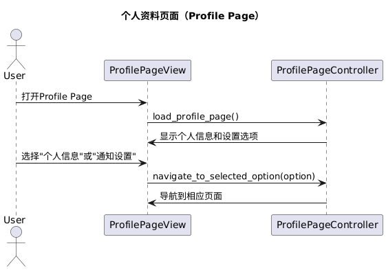

### View

#### Components

- `title_label` - "Profile Setting"
- `to_personal_information_page_button`
- `to_notification_setting_page_button`

### Controller

#### Functions

- **load_profile_page(user: User) -> None**
  - Displays options:
    - Personal Information.
    - Notification Settings.
- **navigate_to_personal_information() -> None**
  - Navigates to the Personal Information Page.
- **navigate_to_notification_settings() -> None**
  - Navigates to the Notification Setting Page.

## 7. Personal Information Page

### Sequence Diagram

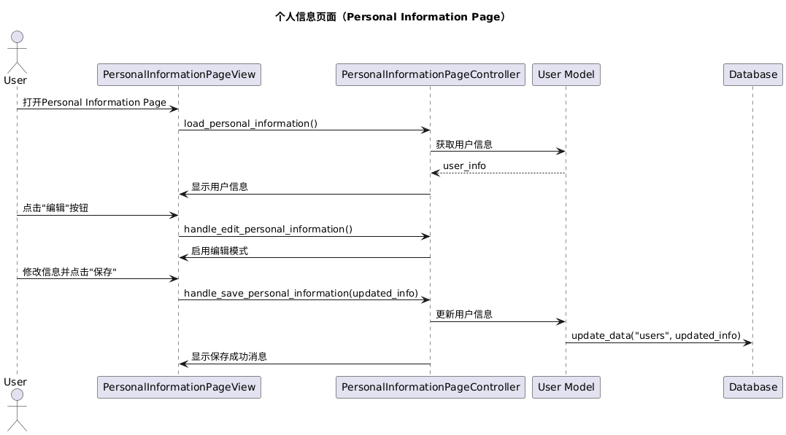

### View

#### Components

- `title_label` - "Personal Information"
- Labels for personal details:
  - `first_name_label`
  - `last_name_label`
  - `gender_label`
  - `birthday_label`
  - `hkid_label`
  - `phone_number_label`
  - `email_label`
  - `password_label`
- `edit_button`
- `save_button`

### Controller

#### Functions

- **load_personal_information(user: User) -> None**
  - Displays the user's personal information.
- **handle_edit_personal_information() -> None**
  - Enables editing of personal information fields.
- **handle_save_personal_information(updated_info: dict[str, any]) -> None**
  - Validates and saves updated information via `Database.update_data("users", updated_info)`.
  - Displays success or error messages.

## 8. Notification Setting Page

### Sequence Diagram

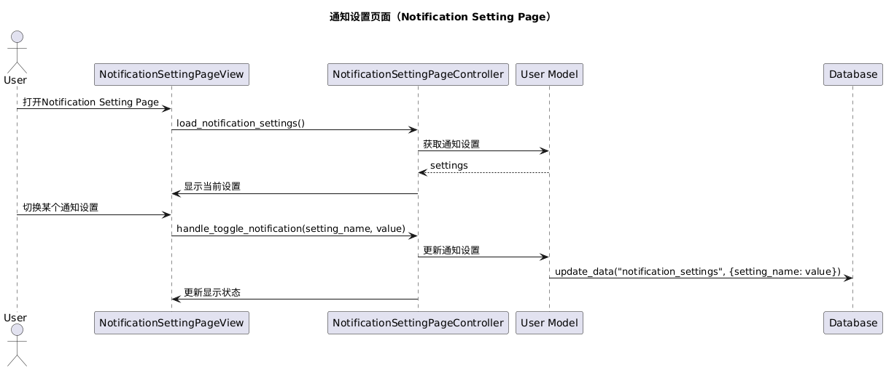

### View

#### Components

- `title_label` - "Notification Settings"
- `horizontal_line_label` - "Flight"
- `setting_container` (5 instances)
  - `title_label`
  - `explain_label`
  - `toggle_button`
- `horizontal_line_label` - "Baggage"
- `setting_container` (4 instances)
  - Same components as above

### Controller

#### Functions

- **load_notification_settings(user: User) -> None**
  - Retrieves and displays user's notification preferences.
- **handle_toggle_notification(setting_name: str, value: bool) -> None**
  - Updates notification settings in the `Database.update_data("notification_settings", {setting_name: value})`.

## 9. Notification Center Page

### Sequence Diagram

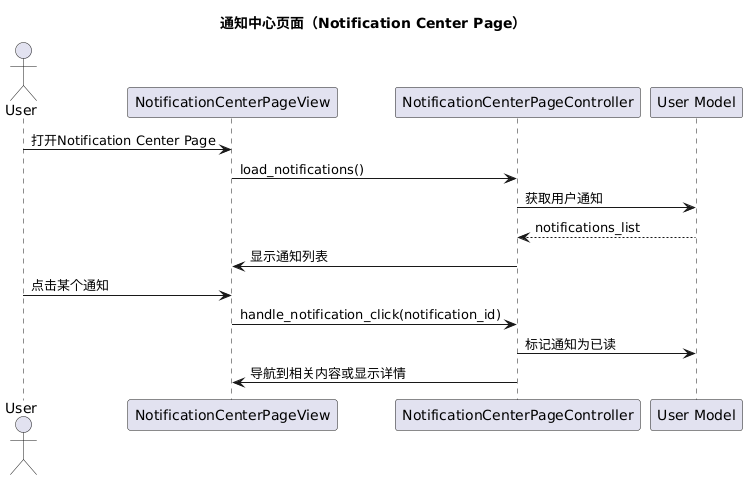

### View

#### Components

- `title_label` - "Notification"
- `notification_clickable_container` (n instances)
  - `title_label`
  - `datetime_label`
  - `detail_label`

### Controller

#### Functions

- **load_notifications(user: User) -> None**
  - Retrieves notifications for the user.
- **handle_notification_click(notification_id: str) -> None**
  - Marks notification as read.
  - Navigates to related content if applicable.

## 10. Boarding Information Page

### Sequence Diagram

### View

#### Components

- `title_label` - "Boarding Information"
- `boarding_info_card_container` (per flight)
  - Flight details and actions:
    - `title_label`
    - `gate_label`
    - `departure_time_label`
    - `boarding_type_label`
    - `count_label`
    - `seat_label`
    - `to_map_page_button` (updated to navigate to the Map Page)
    - `live_stream`
    - `checkin_counter_label`
    - `operating_hour_label`

### Controller

#### Functions

- **load_boarding_information(user: User) -> None**
  - Retrieves flights via `user.get_flights()`.
  - Populates boarding information for each flight.
- **handle_view_map(flight_number: str) -> None**
  - Navigates to the Map Page, showing navigation to the flight's boarding gate.
- **handle_live_stream(flight_number: str) -> None**
  - Starts live stream using `Flight.boarding_gate.streaming_link`.

## 11. My Flight Page

### Sequence Diagram

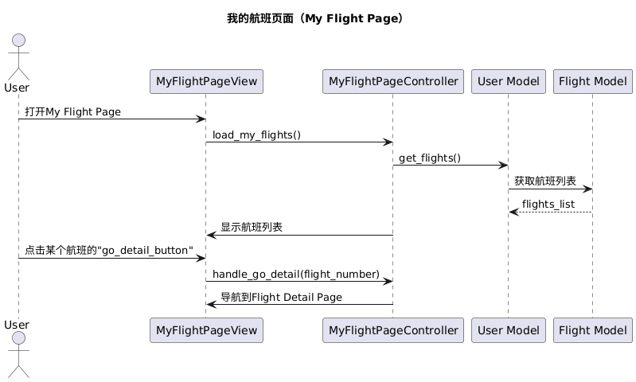

### View

#### Components

- `title_label` - "My Flights"
- `flight_card_container` (per flight)
  - Flight overview:
    - `title_label`
    - `flight_departure_time_label`
    - `subtitle_label`
    - `flight_time_detail`
    - `airport_name`
    - `go_detail_button` (newly added to direct to Flight Detail Page)

### Controller

#### Functions

- **load_my_flights(user: User) -> None**
  - Retrieves and displays user's flights.
- **handle_flight_selection(flight_number: str) -> None**
  - Navigates to Flight Detail Page for the selected flight.
- **handle_go_detail(flight_number: str) -> None**
  - Navigates to the Flight Detail Page (triggered by `go_detail_button`).

## 12. My Baggage Page

### Sequence Diagram

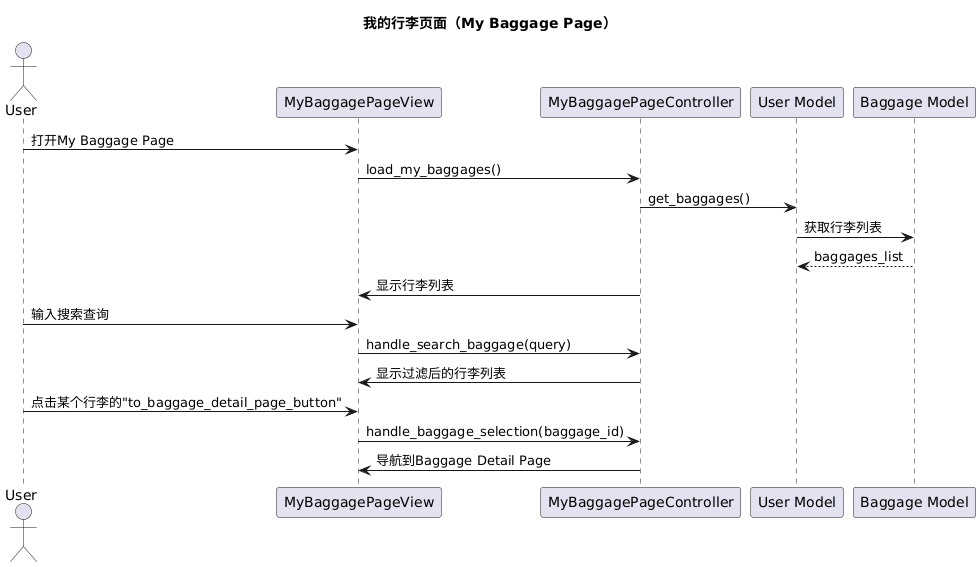

### View

#### Components

- `title_label` - "My Baggages"
- `searchbar_field`
- `baggage_card_container` (per baggage)
  - Baggage overview:
    - `title_label`
    - `status_label`
    - `flight_number_label`
    - `current_location_label`
    - `to_baggage_detail_page_button`

### Controller

#### Functions

- **load_my_baggages(user: User) -> None**
  - Retrieves and displays user's baggages.
- **handle_search_baggage(query: str) -> None**
  - Filters baggage list based on search query.
- **handle_baggage_selection(baggage_id: str) -> None**
  - Navigates to Baggage Detail Page for the selected baggage.

## 13. Flight Detail Page

### Sequence Diagram

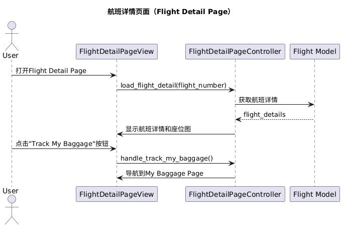

### View

#### Components

- `title_label` - "Flight Detail -> {Flight.flight_number}"
- `flight_seat_map_image`
- `flight_details_label`
- `to_my_baggage_page_button`

### Controller

#### Functions

- **load_flight_detail(flight_number: str) -> None**
  - Retrieves flight details via `Flight` model.
  - Displays seat map and flight details.
- **handle_track_my_baggage() -> None**
  - Navigates to My Baggage Page.

## 14. Baggage Detail Page

### Sequence Diagram

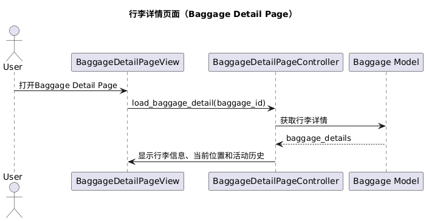

### View

#### Components

- `title_label` - "Baggage Detail -> {Baggage.baggage_id}"
- `baggage_info_label`
- `baggage_location_label`
- `baggage_activity_history_label`

### Controller

#### Functions

- **load_baggage_detail(baggage_id: str) -> None**
  - Retrieves baggage details via `Baggage` model.
  - Displays baggage information, current location, and activity history.

## 15. Map Page

### Sequence Diagram

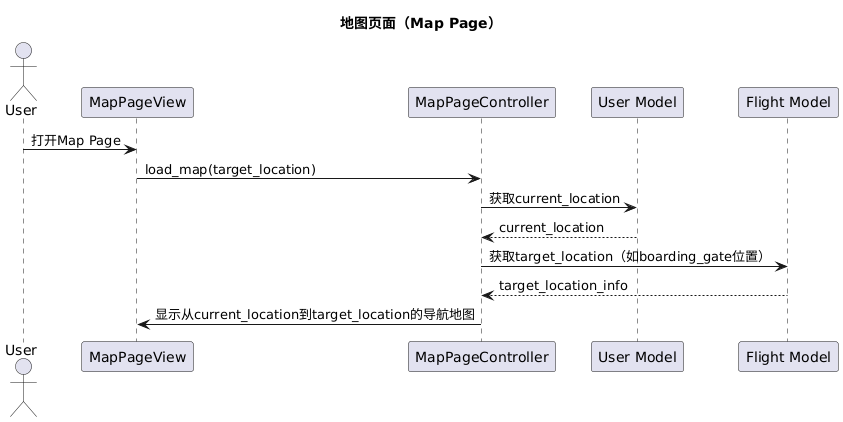

### View

#### Components

- `title_label` - "Map"
- `navigation_map` - Shows navigation from the user's current location to the target location (e.g., boarding gate)

### Controller

#### Functions

- **load_map(target_location: str, user: User) -> None**
  - Retrieves user's current location (`user.current_location`).
  - Displays navigation from current location to `target_location` on the map.
- **handle_location_update(new_location: str) -> None**
  - Updates user's current location in `User` model and `Database.update_data()` if necessary.
